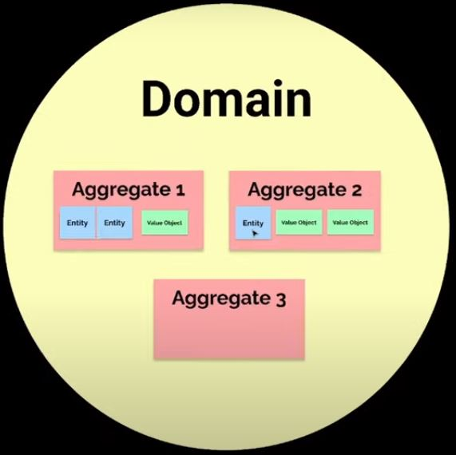
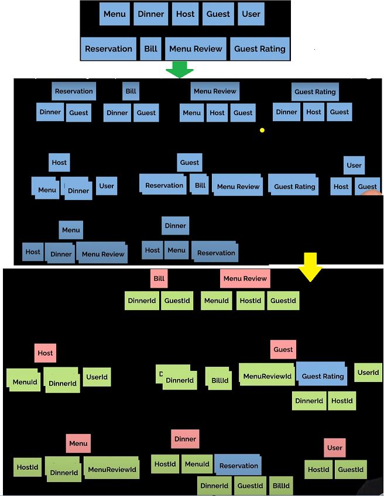
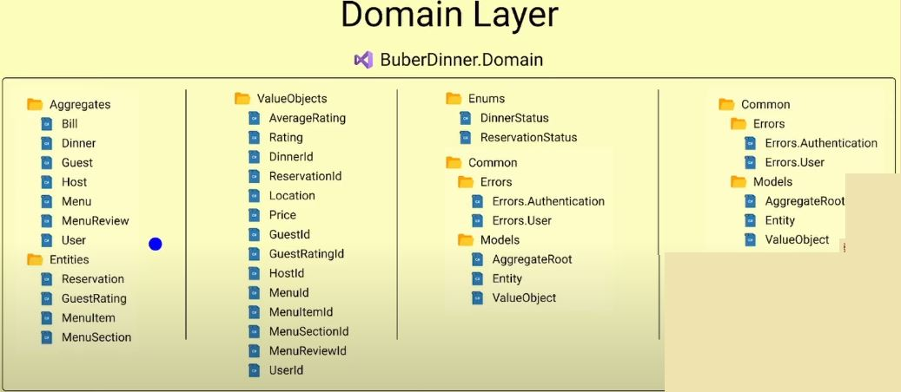
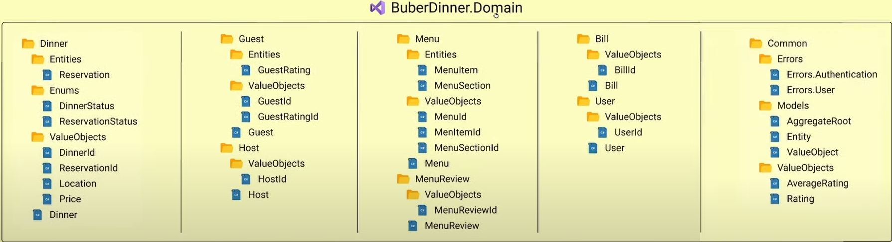
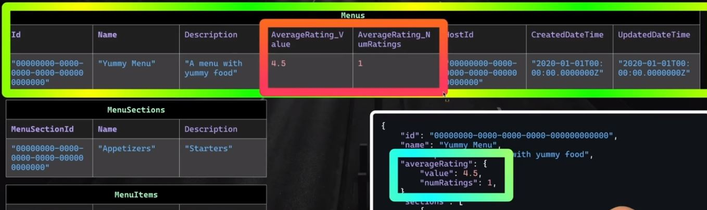
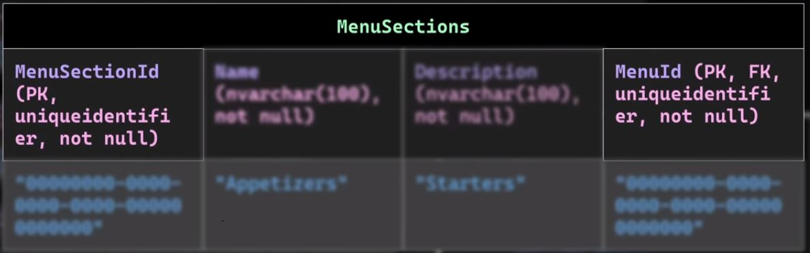

# Global Error Handling
1. Via middleware
2. Via exception filter attribute
3. Problem details
4. Via error endpoint
5. Custom problem details factory


# Flow control
1. Via exceptions
2. Via OneOf
3. Via FluentResults
4. Via ErrorOr & Domain Error

# CQRS + MediatR =
1. CQS vs CQRS
```
CQS (Command Query Seperation):
A command (procedure) does something but does not return a result.
A query (function or attribute) returns a result but does not change the state.
```

```
CQRS (Command query responsibility segregation):
The fundamental difference is that in CQRS objects are split into two objects, one containing the Commands one containing the Queriess.
```
2. MediatR + Mediator Pattern
3. Split by Feature & Clean Architecture


# Object Mapping - Mapster (~ AutoMapper)

# Validation Behavior | MediaR + FluentValidation

# JWT Bearer Authentication

# 3 Steps for Modeling a Complex Domain
```
To recap:															|	Tóm lại:
1. Identify Entities and treat each entity as an aggregate root		|	1. Xác định các Thực thể và coi mỗi thực thể là một gốc tổng hợp
2. Identify relationships between the entities						|	2. Xác định mối quan hệ giữa các thực thể
3. Merge aggregates if there are constraints						|	3. Hợp nhất các aggregate nếu có ràng buộc
																	|
Possible constraints:												|	Hạn chế có thể:
1. Enforcing Invariants												|	1. Thực thi bất biến
2. Eventual consistency cannot be tolerated							|	2. Không thể dung thứ cho sự nhất quán cuối cùng
																	|
Good indicators that an entity should be an aggregate root:			|	Các chỉ số tốt cho thấy một thực thể phải là gốc tổng hợp:
1. It is referenced by other aggregates								|	1. Nó được tham chiếu bởi các aggregate khác
2. It will be looked up by Id										|	2. Nó sẽ được tra cứu bởi Id

```




# Domain Layer Structure & Skeleton



# EF Core & Domain-Drive Design (Mapping Aggregates to Relational Databases)
1. DDD & EF Core - Enforcing DDD Principles
2. 3 Steps for mapping an aggregate to relational database
3. EF Core's Fluent API & DDD
4. SQL Server on a Docker container
5. Migrations and more using the EF Core CLI
6. VSCode + SQL Server
`sql server run in docker`
```docker pull mcr.microsoft.com/mssql/server:2022-latest
docker run -e 'HOMEBREW_NO_ENV_FILTERING=1' -e 'ACCEPT_EULA=Y' -e 'SA_PASSWORD=123456Aa@' -p 1433:1433 -d mcr.microsoft.com/mssql/server:2022-latest```

## What's the big deal

### Persistence Ignorance (Tránh dính líu đến nguồn dữ liệu (persistence))
- Our domain layer logic and models shouldn't be defined based on the database choice.

### DDD Building Blocks 1
- Aggregate identifier should be unique within the entire system.

`Aggregate: id: GUID`
`Aggregate 1: id=9245fe4a-d402-451c-b9ed-9c1a04247482`
`Aggregate 2: id=b1754c14-d296-4b0f-a09a-030017f4461f`

### DDD Building Blocks 2
- Entity identifier should be unique within the aggregate.

`Entity: id: AUID`
`Entity 1: id=1`
`Entity 2: id=1`

==>
```
Aggregate 1 {
	id=9245fe4a-d402-451c-b9ed-9c1a04247482
	Entity1={
		id=1
	}
}
Aggregate 2 {
	id=b1754c14-d296-4b0f-a09a-030017f4461f
	Entity2={
		id=1
	}
}
```
### DDD Building Blocks 3
- Value Objects don't have an identifier.

### DDD Building Blocks 4
- Changes to one aggregate shouldn't affect other aggregates

```
Aggregate 1 {
	id=9245fe4a-d402-451c-b9ed-9c1a04247482
	Entity1={
		id=1
	}
	ValueObject1
}
Aggregate 2 {
	id=b1754c14-d296-4b0f-a09a-030017f4461f
	Entity2={
		id=1
	}
	ValueObject2
}
```

## Aggregate to Relational Database Steps
1. Tables
2. Foreign Keys
3. Type & Other Constraints

### Table splitting/Table Sharing
- Two or more entities that share a single table


### Composite Keys
- Two or more columns that compose a key-Convertions will only set up a composite key in specific cases - like for an owned type collection.


### Surrogate Keys
- A key of any type that is lives for the sole purpose of uniquely identify a record in a table.

### Owned Entity
 - "EF Core allows you to model entity types that can only ever appear on navigation properties of other entity types. 
 These are called owned entity types.
 The entity containing an owned entity type is its owner" --> Microsoft docs